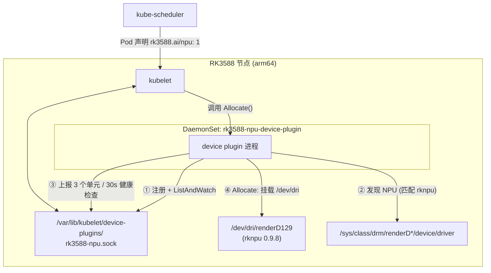

# RK3588 NPU Device Plugin for Kubernetes

**让瑞芯微 RK3588 / RK3588S 的 NPU 在 Kubernetes 中像 CPU、内存一样被调度。**

**Schedule the Rockchip RK3588 / RK3588S NPU in Kubernetes like any other resource.**

[](LICENSE)
[](go.mod)
[](#环境要求--requirements)
[](https://kubernetes.io/docs/concepts/extend-kubernetes/compute-storage-net/device-plugins/)

> 瑞芯微官方（`airockchip`）至今**没有提供**任何 Kubernetes Device Plugin。本项目是为了填补这个空白而写的一个最小、可读、可维护的实现，已在 **麒麟 V10 国防版 / openEuler + Kubernetes 异构集群**中完成落地验证。

---

## 目录 / Table of Contents

| 章节 | Section |
|---|---|
| [1. 这是什么](#1-这是什么--what-is-this) | [What is this](#1-这是什么--what-is-this) |
| [2. 核心特性](#2-核心特性--features) | [Features](#2-核心特性--features) |
| [3. 与现有开源项目对比](#3-与现有开源项目对比--comparison) | [Comparison](#3-与现有开源项目对比--comparison) |
| [4. 环境要求](#4-环境要求--requirements) | [Requirements](#4-环境要求--requirements) |
| [5. 快速开始](#5-快速开始--quick-start) | [Quick Start](#5-快速开始--quick-start) |
| [6. 使用事项](#6-使用事项--usage-notes) | [Usage Notes](#6-使用事项--usage-notes) |
| [7. 重要限制](#7-重要限制--limitations) | [Limitations](#7-重要限制--limitations) |
| [8. 配置项](#8-配置项--configuration) | [Configuration](#8-配置项--configuration) |
| [9. 工作原理](#9-工作原理--how-it-works) | [How it works](#9-工作原理--how-it-works) |
| [10. 常见问题](#10-常见问题--faq) | [FAQ](#10-常见问题--faq) |
| [11. Roadmap](#11-roadmap) | [Roadmap](#11-roadmap) |
| [English Summary](#english-summary) | |

---

## 1. 这是什么 / What is this

RK3588 内置的 NPU 提供 6 TOPS 算力（3 个 NPU 计算核心），但它挂在 **DRM 框架**下，以 render node 的形式暴露（典型路径 `/dev/dri/renderD129`），既不是字符设备也不是 `/dev/galcore`——所以**没有任何现成的 K8s 设备插件可以直接用**。

本项目实现 Kubernetes [Device Plugin API](https://kubernetes.io/docs/concepts/extend-kubernetes/compute-storage-net/device-plugins/) 的 5 个 gRPC 接口，把 RK3588 的 NPU 注册成节点上的一种可调度资源：

```
rk3588.ai/npu
```

于是业务 Pod 只需在 `resources.limits` 里声明，调度器就会自动把它放到有 NPU 的节点上，**不需要写 `nodeAffinity`、不需要知道底层是 RK3588 还是别的芯片**。这也是把 RK3588 与昇腾 310B 等其他国产 NPU 放进同一个集群做**统一调度**的基础。

---

## 2. 核心特性 / Features

| 特性 | 说明 |
|---|---|
| 🔍 **sysfs 动态设备发现** | 遍历 `/sys/class/drm/renderD*/device/driver` 软链接匹配 `rknpu`，**不硬编码 renderD129**。不同板卡 / 不同内核的 render node 编号不同也能正确识别；找不到才 fallback 到静态路径。 |
| 💚 **真实健康检查** | `ListAndWatch` 每 30s 用 `os.Stat` 复查设备节点，设备消失时把设备标记为 `Unhealthy`，避免把 Pod 调度到已经掉驱动的节点。 |
| 🎯 **上报 3 个可分配单元** | 对应 RK3588 的 3 个 NPU core，相当于给内核级调度加了一层 K8s 侧的并发上限（详见 [重要限制](#7-重要限制--limitations)）。 |
| 📦 **离线 vendor 构建** | 依赖已 `go mod vendor` 到仓库，`CGO_ENABLED=0` 静态编译，**内网 / 信创离线环境可直接构建**，不依赖 Go proxy 与公网。 |
| 🐳 **极小镜像** | 多阶段构建，最终镜像基于 `alpine:3.21.3`（arm64），约 15 MB。 |
| 🧩 **单文件、零框架依赖** | 全部逻辑在 `main.go` 一个文件里，不引入 `device-plugin-manager` 等封装框架，便于二次开发和源码级排查。 |
| 🇨🇳 **信创环境验证** | 在 **麒麟 V10 国防版（瑞芯微定制版）+ openEuler 22.03** 的异构 K8s 集群（v1.23.17 + KubeSphere 4.1.3）中完成验证。 |

---

## 3. 与现有开源项目对比 / Comparison

目前社区里能找到的相关项目共 5 个。**瑞芯微官方（`airockchip/rknn-toolkit2`、`rknn-llm`、`rknn_model_zoo`）只有推理 SDK，没有 K8s Device Plugin。**

| 项目 | 资源名 | 设备发现方式 | 上报单元数 | 健康检查 | 运行形态 | 许可 |
|---|---|---|---|---|---|---|
| **本项目** | `rk3588.ai/npu` | **sysfs 动态 + 静态 fallback** | **3** | ✅ 30s 周期 | 直接实现 gRPC，无框架 | Apache-2.0 |
| [`elct9620/rknpu-device-plugin`](https://github.com/elct9620/rknpu-device-plugin) | `rock-chips.com/rknpu` | 硬编码 `/dev/dri/renderD129` | 1 | ❌ 空 `select{}` 阻塞 | 基于 kubevirt `dpm` 框架 | MIT |
| [`akolk/ai-cluster`](https://github.com/akolk/ai-cluster) → [`rsJames-ttrpg/npu-device-plugin`](https://github.com/rsJames-ttrpg/npu-device-plugin) | — | 硬编码 `/dev/dri/renderD129` | — | — | 需业务 Pod `privileged: true` | — |
| [`schwankner/talos-rk3588-npu`](https://github.com/schwankner/talos-rk3588-npu) | `rockchip.com/npu` | `/dev/rknpu` | 3 | — | **CDI** + Talos Linux 专用 | — |
| [`antonioacg/rknpu-rk3588`](https://github.com/antonioacg/rknpu-rk3588) | — | — | — | — | 实为 **DKMS 内核模块移植**，非 device plugin | GPL-2.0 |
| [`jfreed-dev/turing-rk1-cluster`](https://github.com/jfreed-dev/turing-rk1-cluster) | — | — | — | — | 集群仓库，内含插件用法 | Apache-2.0 |

> 对比信息基于 2026-09 的公开仓库状态，如有偏差欢迎提 Issue 指正。

**本项目的差异点**：`sysfs 动态发现` + `上报 3 单元` + `真实健康检查` + `离线 vendor 构建` + `信创国产 OS 验证` 这几项，在上述项目中**没有被同时覆盖**。

---

## 4. 环境要求 / Requirements

| 项目 | 要求 |
|---|---|
| 架构 | `aarch64` / `arm64` |
| SoC | RK3588 / RK3588S |
| 内核驱动 | `rknpu`（DRM render node 形态）。已在 `rknpu 0.9.8 20240828` 验证 |
| 操作系统 | 麒麟 V10（含国防版）、openEuler 等；任何内核自带 `rknpu` 驱动的 arm64 发行版理论上均可 |
| Kubernetes | 已在 **v1.23.17** 验证；插件基于稳定的 `v1beta1` Device Plugin API |
| 容器运行时 | Docker 或 containerd 均可 |
| 构建环境 | Go 1.20+（仓库已 vendor 依赖）；或任意可运行 Docker buildx 的机器 |

### 前置检查：先确认节点上真的有 NPU

**不要照抄网上教程去找 `/dev/galcore`**——主线 `rknpu` 驱动不创建这个节点。正确做法是先读内核日志：

```bash
dmesg | grep -i npu
```

关键在这一行（`on minor N`）：

```
[    4.256439] [drm] Initialized rknpu 0.9.8 20240828 for fdab0000.npu on minor 1
```

DRM render node 的命名公式是 `renderD(128 + minor)`，所以：

```
设备路径 = /dev/dri/renderD(128 + 1) = /dev/dri/renderD129
```

验证：

```bash
ls -la /dev/dri/
# 应能看到 renderD128 (GPU) 与 renderD129 (NPU)

ls /dev | grep -E 'galcore|rknpu'
# 预期的结果是「什么都没有」，这不代表驱动没装上
```

---

## 5. 快速开始 / Quick Start

### 5.1 构建镜像

**方式 A：在 x86 开发机上交叉构建（推荐）**

```bash
docker buildx build --platform linux/arm64 \
  -t your-registry/rk3588-device-plugin:v1.0.0 \
  --load .
```

> ⚠️ 常见误区：`--platform=linux/arm64` 只是告诉 buildx **目标**架构。如果 `FROM` 的 `golang` 基础镜像是 amd64 版本，产出的二进制依然是 x86 的，在 arm64 节点上根本跑不起来。本仓库的 `Dockerfile` 已用 arm64 基础镜像 + `CGO_ENABLED=0`，可放心使用。

**方式 B：直接在 3588 节点上编译**

节点已装 Go 1.20+ 与 Docker 时，可用仓库自带脚本：

```bash
bash deploy/build-on-node.sh your-registry/rk3588-device-plugin:v1.0.0
```

该脚本会编译本地 `aarch64` 二进制 → 构建镜像 → 推送 → 部署 DaemonSet → 打印验证命令。

**内网 / 离线环境**：依赖已 vendor，`go build -mod=vendor` 全程不需要网络。若需重新拉取依赖，在能联网的机器上执行：

```bash
docker run --rm -v "$(pwd)":/build -w /build \
  -e GOPROXY=https://goproxy.cn,direct \
  golang:1.24.3 sh -c "go mod tidy && go mod vendor"
```

### 5.2 给 RK3588 节点打标签

DaemonSet 通过节点标签选择目标节点，**必须先打标签**：

```bash
kubectl label node node2 node3 node5 hardware-type=rk3588
```

> 为什么必须打标签：插件在**检测不到 NPU 时会 `os.Exit(0)` 正常退出**（避免在非 RK3588 节点上报假资源）。如果不限制节点范围，非 RK3588 节点上的 Pod 会因为退出而被反复重启，产生无意义的 CrashLoop 日志。

### 5.3 部署插件

先把 `deploy/daemonset.yaml` 里的镜像地址换成你自己的：

```yaml
image: your-registry/rk3588-device-plugin:v1.0.0
```

然后应用：

```bash
kubectl apply -f deploy/daemonset.yaml
kubectl -n kube-system rollout status daemonset/rk3588-npu-device-plugin
```

### 5.4 验证

**① 看插件日志**

```bash
kubectl -n kube-system logs daemonset/rk3588-npu-device-plugin
```

预期输出：

```
[INFO] RK3588 NPU Device Plugin starting...
[INFO] NPU detected via sysfs: /dev/dri/renderD129
[INFO] Plugin started | device=/dev/dri/renderD129 | lib=/usr/lib/librknnrt.so | count=3
```

> 如果看到 `NPU detected via static path: ...` 说明 sysfs 匹配没命中、走了 fallback，功能仍正常，但建议检查 `/sys/class/drm` 是否已挂载进容器。
>
> 如果看到 `librknnrt.so not found` 是**正常**的：插件自身不需要这个库，只是顺带探测以便自动挂载给业务容器。

**② 看节点资源**

```bash
kubectl describe node node2 | grep -A3 rk3588
```

预期出现：

```
  rk3588.ai/npu:  3
  rk3588.ai/npu:  3
```

**③ 跑一个验证 Pod**

```bash
kubectl apply -f deploy/test-pod.yaml
kubectl logs test-rk3588-npu
```

预期能在容器内看到 `/dev/dri/renderD129`，且环境变量包含 `RKNN_NPU_DEVICE`。

---

## 6. 使用事项 / Usage Notes

### 6.1 业务 Pod 怎么声明

只需一处——`resources.limits`。**不需要写 `nodeAffinity`**，调度器会自动选择有 NPU 空闲资源的节点：

```yaml
apiVersion: v1
kind: Pod
metadata:
  name: rknn-inference
spec:
  containers:
    - name: infer
      image: your-rknn-app:latest
      resources:
        limits:
          rk3588.ai/npu: "1"     # 有且只需这一行
        requests:
          rk3588.ai/npu: "1"
```

完整业务示例见 [`deploy/app-example.yaml`](deploy/app-example.yaml)。

### 6.2 插件自动注入的内容

Pod 被调度后，插件在 `Allocate()` 阶段返回：

| 类型 | 内容 | 说明 |
|---|---|---|
| Mount | 宿主机 `/dev/dri` → 容器 `/dev/dri` | 挂**整个目录**而非单个 renderD129，因为 `librknnrt.so` 初始化时可能需要同时访问 card 与 render 节点 |
| Mount | 宿主 `librknnrt.so` → 容器同路径（只读） | 仅当插件在宿主机上探测到该库时才会注入 |
| Env | `RKNN_NPU_DEVICE` | 渲染节点在**容器内**的路径，如 `/dev/dri/renderD129` |
| Env | `RKNN_NPU_ENABLE=1` | 便于业务侧做开关判断 |
| Env | `RKNN_LOG_LEVEL=0` | RKNN 日志级别（会被 Pod spec 中同名 env 覆盖） |
| Env | `RK3588_NPU_DEVICES` | 本次分配到的设备 ID 列表，如 `[rk3588-npu-0]` |

### 6.3 业务镜像需要自带 `librknnrt.so`

这是**最容易踩的坑**：`librknnrt.so` 是 RKNN 运行时库，**不属于** device plugin 的职责范围。业务镜像必须自己带上它：

```dockerfile
# 从 3588 节点上把 /usr/lib/librknnrt.so 拷贝到构建上下文后
COPY librknnrt.so /usr/lib/
RUN ldconfig
```

或者直接从官方 SDK 取：`airockchip/rknn-toolkit2` 仓库的 `rknpu2/runtime/Linux/librknn_api/aarch64/`。

### 6.4 关于 `privileged`（重要）

本插件**只负责注入设备节点**，Pod 本体是否需要在**特权模式**下运行，取决于业务代码怎么访问 NPU：

- 只用 `librknnrt.so` 的标准推理接口 → 通常**不需要**特权；
- 使用 `rknn-toolkit2` 的部分接口（会读取 `/proc/device-tree/compatible` 来判断 SoC 型号）→ **需要**特权，因为 K8s 默认会把容器里的 `/proc` 做遮蔽（masked），该路径读不到。

> 📌 这一点是参考社区项目（`akolk/ai-cluster`、`schwankner/talos-rk3588-npu`）的经验总结，**本项目未在麒麟 V10 上逐一验证**。如果你的业务报「无法识别平台 / SoC 检测失败」，优先按这个方向排查。
>
> 社区里给出过两种非特权方案：`securityContext.procMount: Unmasked` + `spec.hostUsers: false`（需要内核 ≥ 6.3 的 `MOUNT_ATTR_IDMAP` 支持）。麒麟 V10 国防版的定制内核版本较老，**大概率不支持**该方案，此时只能用 `privileged: true`。

### 6.5 卸载

```bash
kubectl delete -f deploy/daemonset.yaml
kubectl label node node2 node3 node5 hardware-type-
```

---

## 7. 重要限制 / Limitations

请在使用前明确以下几点，避免踩到「以为有硬隔离、实际上没有」的坑：

1. **3 个单元是「软件并发上限」，不是硬件隔离。**
   RK3588 的 3 个 NPU core 共享**同一个** DRM render node，从 K8s 视角无法感知单个 core。因此插件上报的 `rk3588-npu-0/1/2` 三个设备**物理上是同一个设备**，`maxDevices=3` 只是限制「同时最多 3 个容器使用 NPU」，真正的 core 级调度由内核驱动完成。
   → 一个容器拿到 `1` 个单元 **不代表独占 1 个 core**，也不代表算力被隔离。这与 GPU 的 HAMi 显存/算力切分是完全不同的性质。

2. **不支持 `GetPreferredAllocation` 的实际逻辑。** 该方法返回空响应（满足 v1beta1 接口契约要求），因为底层只有一个物理设备，没有「选哪个更好」的空间。

3. **未实现 CDI。** `schwankner/talos-rk3588-npu` 的 CDI 方案能在免特权下注入设备，是更现代的做法，但它依赖 Talos + 主线内核 6.18+。本项目走的是「挂载设备节点」的经典路线，兼容性更好但不支持 CDI。

4. **仅 arm64。** RK3588 本身是 arm64 SoC，不涉及 amd64 场景。

5. **资源名 `rk3588.ai/npu` 是一个自定义字符串**，不是已注册的真实域名。若你的组织有内部域名规范，改 `main.go` 中的 `resourceName` 常量即可。

---

## 8. 配置项 / Configuration

### 8.1 编译期常量（`main.go`）

| 常量 | 默认值 | 说明 |
|---|---|---|
| `resourceName` | `rk3588.ai/npu` | 注册到 K8s 的资源名。改动后所有业务 YAML 需同步修改 |
| `maxDevices` | `3` | 上报的可分配单元数。**不要超过 3**（物理 core 数），调大没有意义 |
| `serverSock` | `<device-plugin-path>/rk3588-npu.sock` | 与 kubelet 通信的 Unix Socket |

### 8.2 设备探测路径

探测顺序（`detectNPU()`）：

1. **sysfs 动态发现**：`/sys/class/drm/renderD*/device/driver` 软链接包含 `rknpu` → 命中
2. **静态 fallback**：`/dev/dri/renderD129` → `/dev/dri/renderD128` → `/dev/galcore`

> 因此 DaemonSet **必须**同时挂载 `/dev/dri` 与 `/sys/class/drm`，否则第 1 步必然失败。详见 [`deploy/daemonset.yaml`](deploy/daemonset.yaml)。

### 8.3 DaemonSet 关键字段

| 字段 | 值 | 原因 |
|---|---|---|
| `hostNetwork` | `true` | 便于与 kubelet 的 socket 通信 |
| `priorityClassName` | `system-node-critical` | 插件需早于业务 Pod 启动 |
| `securityContext.privileged` | `true` | 需要写入 `/var/lib/kubelet/device-plugins/` |
| 节点选择 | 标签 `hardware-type=rk3588` | 避免在非 RK3588 节点上反复重启 |

---

## 9. 工作原理 / How it works



调度链路：

```
Pod 声明 rk3588.ai/npu: 1
        ↓
kube-scheduler 寻找剩余 rk3588.ai/npu ≥ 1 的节点
        ↓
kubelet 调用 Device Plugin 的 Allocate()
        ↓
插件返回：挂载哪些设备文件、注入哪些环境变量
        ↓
容器启动，可直接访问 /dev/dri/renderD129
```

### 实现的 gRPC 接口

| 方法 | 本项目实现 |
|---|---|
| `GetDevicePluginOptions` | 声明 `PreStartRequired: true` |
| `ListAndWatch` | 上报 3 个设备，每 30s 复查设备节点是否存在并更新健康状态 |
| `Allocate` | 挂载 `/dev/dri` + `librknnrt.so`，注入环境变量与注解 |
| `GetPreferredAllocation` | 空实现（接口契约要求，无实际优选逻辑） |
| `PreStartContainer` | 打印日志后返回空响应 |

更详细的实现原理与设计取舍见 [`docs/DESIGN.md`](docs/DESIGN.md)；实战排错见 [`docs/TROUBLESHOOTING.md`](docs/TROUBLESHOOTING.md)。

---

## 10. 常见问题 / FAQ

<details>
<summary><b>Q：找不到 /dev/galcore，是驱动没装吗？</b></summary>

不是。`/dev/galcore` 是**旧版内核或特定发行版**的历史设备名，主线 `rknpu` 驱动挂在 DRM 框架下，不创建该节点。用 `dmesg | grep -i npu` 找到 `on minor N`，设备就是 `/dev/dri/renderD(128+N)`。
</details>

<details>
<summary><b>Q：编译报 <code>does not implement v1beta1.DevicePluginServer (missing method GetPreferredAllocation)</code>？</b></summary>

kubelet API v0.27+ 强制要求实现该方法。本项目已提供空实现，直接编译即可。若你自行裁剪代码，记得保留它。
</details>

<details>
<summary><b>Q：节点上 <code>rk3588.ai/npu</code> 计数是 0？</b></summary>

按顺序排查：① 节点标签 `hardware-type=rk3588` 打了吗；② DaemonSet 的 Pod 是否 Running；③ Pod 日志是否出现 `No RK3588 NPU device found`（说明 `/sys/class/drm` 或 `/dev/dri` 没挂进去）；④ 节点 `dmesg | grep -i rknpu` 驱动是否正常加载。
</details>

<details>
<summary><b>Q：Pod 一直 Pending，报 insufficient rk3588.ai/npu？</b></summary>

三个单元已被占满，或目标节点没有打标签。用 `kubectl describe node <name> | grep -A5 "Allocated resources"` 看已分配情况。
</details>

<details>
<summary><b>Q：容器里推理报 SoC 检测失败 / 平台不支持？</b></summary>

见 [6.4 关于 privileged](#64-关于-privileged重要)——大概率是 `/proc/device-tree/compatible` 被遮蔽，需要给业务 Pod 加 `securityContext.privileged: true`。
</details>

<details>
<summary><b>Q：为什么非 RK3588 节点上的插件 Pod 一直在重启？</b></summary>

插件检测不到 NPU 会 `os.Exit(0)` 主动退出，DaemonSet 随后重启它。这是**有意设计**（避免上报假资源），解决办法是给 DaemonSet 限定节点范围（默认已用 `hardware-type=rk3588` 标签）。
</details>

---

## 11. Roadmap

- [ ] 支持 **CDI**（Container Device Interface），实现免特权注入
- [ ] 支持 **Node Feature Discovery (NFD)**，自动打标签，免除手工 `kubectl label`
- [ ] 增加 `--resource-name` / `--max-devices` 命令行参数（目前是编译期常量）
- [ ] 补充单元测试与 CI（跨平台交叉编译校验）
- [ ] 适配更多 SoC：RK3576 / RK3568 / RK3566
- [ ] 提供 Helm Chart

欢迎提 Issue / PR。

---

## 12. 相关文章 / Related Reading

- 《异构算力实战：RK3588 + 昇腾 310B 部署 K8s + KubeSphere 并实现 NPU 统一调度》—— 本项目对应的完整实战记录（含昇腾 310B 源码级适配）
  公众号「编码如写诗」：<https://mp.weixin.qq.com/s/eC7ou5RItM8Y5wVOfBbGIQ>
- 博客园：<https://cnblogs.com/tx1st>

---

## English Summary

**What is it.** A Kubernetes [Device Plugin](https://kubernetes.io/docs/concepts/extend-kubernetes/compute-storage-net/device-plugins/) that exposes the Rockchip **RK3588 / RK3588S NPU** as a schedulable resource named `rk3588.ai/npu`. Rockchip's official repositories (`airockchip/rknn-toolkit2`, `rknn-llm`, `rknn_model_zoo`) ship inference SDKs only — **no Kubernetes device plugin exists officially**, which is why this project was written.

**Features.**
- **Dynamic NPU discovery via sysfs** (`/sys/class/drm/renderD*/device/driver` matching `rknpu`), with static fallback paths — no hard-coded `renderD129`.
- **Real health checking** — `ListAndWatch` re-verifies the device node every 30s and marks devices `Unhealthy` when it disappears.
- **Advertises 3 allocatable units** (one per physical NPU core) as a K8s-side concurrency cap.
- **Offline-friendly**: dependencies are vendored, `CGO_ENABLED=0` static build, ~15 MB alpine arm64 image.
- **Single-file, framework-free** implementation for easy auditing and forking.
- Validated on Chinese domestic stacks: **Kylin V10 (defense edition) + openEuler 22.03**, Kubernetes v1.23.17, KubeSphere 4.1.3.

**Quick start.**

```bash
# 1. build (from an x86 machine)
docker buildx build --platform linux/arm64 -t your-registry/rk3588-device-plugin:v1.0.0 --load .

# 2. label the RK3588 nodes
kubectl label node <node> hardware-type=rk3588

# 3. set the image in deploy/daemonset.yaml, then
kubectl apply -f deploy/daemonset.yaml

# 4. verify
kubectl -n kube-system logs daemonset/rk3588-npu-device-plugin
kubectl describe node <node> | grep rk3588
```

**Use it in a workload.**

```yaml
resources:
  limits:
    rk3588.ai/npu: "1"
```

**Important caveats.**
- The 3 units are a **software concurrency limit, not hardware isolation** — all three share one DRM render node, and core-level scheduling is done by the kernel.
- `librknnrt.so` must be shipped **in your own workload image**; the plugin only injects the device node.
- Workloads using `rknn-toolkit2` interfaces that read `/proc/device-tree/compatible` **may require `privileged: true`**, because Kubernetes masks `/proc` by default.
- CDI is **not** implemented (see `schwankner/talos-rk3588-npu` for a CDI-based, privileged-free approach tied to Talos + mainline kernel 6.18+).

See [`docs/DESIGN.md`](docs/DESIGN.md) for internals and [`docs/TROUBLESHOOTING.md`](docs/TROUBLESHOOTING.md) for field-proven troubleshooting.

---

## License

[Apache License 2.0](LICENSE) © 2026 天行1st

本项目的 NPU 设备发现依赖内核 `rknpu` 驱动（GPL-2.0），本项目仅通过 sysfs 与设备节点与之交互，不包含任何内核代码。
